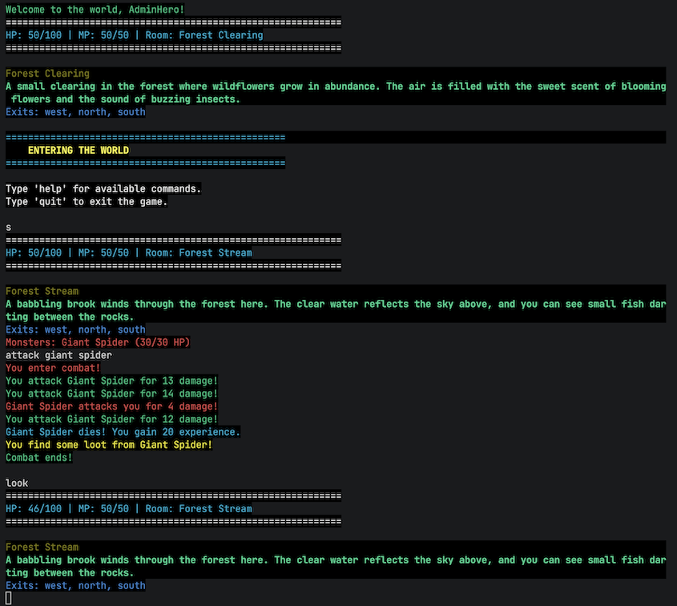

# This project is a WORK IN PROGRESS, and is not yet complete.  It is currently under active development, and please feel free to contribute! Please create feature requests, bug reports, and pull requests! 

# SSH RPG - Text-Based MMORPG
A feature-rich multi-user text-based MMORPG server with SSH and TCP support, featuring character creation, enhanced turn-based combat, safe zones, customizable status lines, world exploration, and comprehensive administrative tools.



## 🎮 Features

- **Multi-user support**: Up to 24 simultaneous players
- **Dual connectivity**: SSH and TCP server support
- **Character system**: Race/class selection with customizable stats
- **World exploration**: 26+ interconnected rooms across 3 distinct areas
- **Enhanced combat system**: Turn-based combat with alternating turns and proper death handling
- **Safe zones**: Temple of Healing and other protected areas where combat is disabled
- **Rest system**: Recover health and mana by resting
- **Customizable status line**: Personalized HUD with 18+ variables for stats and room info
- **Economy**: Three-tier currency system (Silver, Gold, Platinum)
- **Administrative tools**: Debug logging and world management
- **Persistent storage**: PostgreSQL database backend

## 🚀 Quick Start

1. **Setup**: Install PostgreSQL, create virtual environment, install dependencies
2. **Initialize**: Run `python tools/setup_database.py` to create the database
3. **Start Server**: Run `python run_server.py` to start both SSH and TCP servers
4. **Connect**: Use `nc localhost 2223` to connect via TCP
5. **Play**: Register an account, create a character, and start exploring!

**Default Admin Account**: Username: `admin`, Password: `admin123`

## 🗺️ World Structure

### Town Area (9 rooms)
- **Town Outskirts**: Starting location
- **Town Square**: Central hub with fountain (West, Center, East)
- **Temple of Healing**: Sacred sanctuary and safe zone where players respawn after death
- **Town Hall**: Administrative building
- **Market Street**: Shopping district
- **Residential District**: Housing area
- **Blacksmith Quarter**: Crafting area
- **Inn District**: Rest and social area

### Forest Area (9 rooms)
- **Forest Entrance**: Gateway to wilderness
- **Circular layout**: Path North, Clearing, Thicket, Stream, Grove, Deep South, Path West, Ancient Grove
- **Monsters**: Forest Wolf (Lv.2), Giant Spider (Lv.3), Forest Bear (Lv.5)

### Graveyard Area (8 rooms)
- **Graveyard Entrance**: Spooky gateway
- **Haunted locations**: Old Section, Chapel, Crypts, Mausoleum, Haunted area, Deep section, Forgotten corner
- **Undead monsters**: Skeleton Warrior (Lv.4), Restless Spirit (Lv.6), Grave Wraith (Lv.8)

## 💰 Currency System

- **Silver Coin**: Base currency (value: 1)
- **Gold Coin**: Worth 10 silver coins
- **Platinum Coin**: Worth 100 silver coins

All currencies are stackable and dropped by monsters based on difficulty.

## 📊 Status Line System

The status line system allows each player to customize their information display with real-time data.

### Available Variables (18+)
- **Character Info**: `{name}`, `{level}`, `{race}`, `{class}`, `{experience}`
- **Health & Mana**: `{health}`, `{max_health}`, `{mana}`, `{max_mana}`
- **Attributes**: `{strength}`, `{dexterity}`, `{constitution}`, `{intelligence}`, `{wisdom}`, `{charisma}`
- **Location**: `{room_name}`, `{room_id}`, `{exits}`

### Example Status Lines
```
Default: HP: {health}/{max_health} | MP: {mana}/{max_mana} | Room: {room_name}
Compact: {name} Lv.{level} | HP:{health} MP:{mana} | {room_name}
Detailed: [{race} {class}] HP:{health}/{max_health} MP:{mana}/{max_mana} Exits: {exits}
RPG Style: {name} the {race} {class} | Health: {health}/{max_health} | Location: {room_name}
```

### Features
- **Persistent Storage**: Status line preferences saved to database
- **Real-time Updates**: Variables reflect current game state
- **Error Handling**: Invalid variables show helpful error messages
- **Automatic Display**: Appears with every `look` command

## 🛡️ Safe Zones & Combat System

### Safe Zones
- **Temple of Healing**: Sacred sanctuary where combat is disabled
- **Respawn Location**: Players respawn here after death
- **Protected Areas**: No violence can occur in safe zones

### Enhanced Combat Features
- **Alternating Turns**: Players and monsters take turns attacking
- **Proper Death Handling**: Automatic respawn in Temple of Healing
- **Combat Sessions**: Persistent combat state management
- **Experience & Loot**: Gain experience and currency from victories

### Rest System
- **Health Recovery**: Rest to restore health points
- **Mana Recovery**: Rest to restore mana points
- **Cooldown**: 3-tick delay for rest action
- **Safe Activity**: Can rest anywhere, including during exploration

## 📁 Project Structure

```
sshrpg/
├── admin_system.py            # Admin commands and tools
├── character_creation.py      # Character creation system
├── client.py                  # Game client
├── config.yaml                # Server configuration
├── database.py                # Database operations
├── debug_logger.py            # Debug logging system
├── game_engine.py             # Core game logic
├── input_sanitizer.py         # Security and input validation
├── run_server.py              # Server launcher
├── server.py                  # Main game server
├── ssh_server.py              # SSH server implementation
├── requirements.txt           # Python dependencies
├── README.md                  # This file
├── LICENSE                    # Creative Commons license
├── SECURITY_IMPROVEMENTS.md   # Security documentation
├── Screenshot.png             # Game screenshot
├── .gitignore                 # Git ignore rules
├── tests/                     # Test scripts
│   ├── README.md              # Tests documentation
│   ├── test_codebase_health.py # Codebase health tests
│   ├── test_combat.py         # Combat system tests
│   ├── test_monster_system.py # Monster system tests
│   └── test_monsters.py       # Monster functionality tests
└── tools/                     # Utility scripts and tools
    ├── README.md              # Tools documentation
    ├── create_admin_character.py # Admin character creation
    ├── create_world.py        # World creation tool
    ├── debug_exits.py         # Debug utility for room exits
    ├── populate_monsters.py   # Monster population tool
    └── setup_database.py      # Database setup tool
```

## 🛠️ Installation & Setup

### Prerequisites
- Python 3.8+
- PostgreSQL 12+
- Virtual environment (recommended)

### Database Setup
1. Install PostgreSQL and create a database
2. Run the database setup script:
```bash
python tools/setup_database.py
```

### Python Environment
1. Create and activate virtual environment:
```bash
python -m venv venv
source venv/bin/activate  # On Windows: venv\Scripts\activate
```

2. Install dependencies:
```bash
pip install -r requirements.txt
```

### Configuration
Edit `config.yaml` to configure:
- Database connection settings
- Server ports (SSH: 2222, TCP: 2223)
- Maximum players
- Debug settings

## 🚀 Running the Server

### Standard Mode (SSH + TCP)
```bash
python run_server.py
```

### TCP Only Mode
```bash
python run_server.py --no-ssh --tcp-port 2225
```

### Debug Mode
```bash
python run_server.py --no-ssh --tcp-port 2225 --debug-verbosity 2 --debug-components admin_commands
```

### Command Line Options
- `--no-ssh`: Disable SSH server, TCP only
- `--tcp-port PORT`: Set TCP port (default: 2223)
- `--debug-verbosity LEVEL`: Set debug verbosity (0-3)
- `--debug-components COMPONENTS`: Enable debug for specific components

## 🎯 Connecting to the Server

### TCP Connection
```bash
telnet localhost 2225
# or
nc localhost 2225
```

### SSH Connection (if enabled)
```bash
ssh -p 2222 username@localhost
```

## 🎮 Game Commands

### Basic Commands
- `help` - Show available commands
- `look` - Examine current room and display status line
- `inventory` - Check your items
- `stats` - View character statistics
- `quit` - Exit the game

### Movement
- `north`, `south`, `east`, `west` - Move in directions
- `n`, `s`, `e`, `w` - Short movement commands

### Combat & Recovery
- `attack <target>` - Attack a monster (disabled in safe zones)
- `flee` - Escape from combat
- `rest` / `sleep` - Rest to recover health and mana
- `use <item>` - Use an item from your inventory

### Status Line Customization
- `statusline` - Show current status line
- `statusline show` - Display current status line
- `statusline set <format>` - Set custom status line format
- `statusline help` - Show formatting help and available variables

### Social
- `say <message>` - Speak to other players in room
- `tell <player> <message>` - Private message
- `who` - List online players

### Administrative (Admin only)
**Note**: All admin commands start with `/` and require admin access level (2+). Use quotes for multi-word parameters.

#### World Building
- `/create_room "name" "description"` - Create a new room
- `/link_rooms <room1_id> <direction> <room2_id>` - Link two rooms bidirectionally
- `/edit_room <room_id> <property> "value"` - Edit room properties (name, description, properties)
- `/list_rooms [page]` - List all rooms with pagination

#### Item Management
- `/create_item "name" <type> [stats_json]` - Create a new item with optional stats
- `/edit_item <item_id> <property> "value"` - Edit item properties
- `/spawn_item <item_id>` - Spawn item in current room
- `/list_items [page]` - List all items with pagination

#### Monster Management
- `/create_monster "name" <level> [stats]` - Create a new monster template
- `/edit_monster <monster_id> <property> "value"` - Edit monster properties
- `/spawn_monster <monster_id>` - Spawn monster in current room
- `/list_monsters [page]` - List all monster templates with pagination

#### Player Management
- `/teleport <player_name> <room_id>` - Teleport a player to specific room
- `/promote <username>` - Promote user to admin status
- `/demote <username>` - Remove admin status from user
- `/kick <player_name> ["reason"]` - Kick a player from the server
- `/ban <player_name> ["reason"]` - Ban a player from the server
- `/unban <player_name>` - Remove ban from a player

#### Server Management
- `/server_stats` - Show detailed server statistics and player info
- `/broadcast "message"` - Send message to all connected players
- `/reload_world` - Reload world data from database
- `/save_world [filename]` - Save current world state to file
- `/load_world <filename>` - Load world state from file

#### Debug Management
- `/debug_status` - Show current debug logger status and settings
- `/debug_enable [verbosity]` - Enable debug logging (0-3 verbosity levels)
- `/debug_disable` - Disable all debug logging
- `/debug_verbosity <level>` - Set debug verbosity (0=minimal, 1=normal, 2=verbose, 3=very_verbose)
- `/debug_component <component> <on|off>` - Enable/disable debug for specific components

#### Inspection Tools
- `/list_properties <type> <id>` - List all properties of a room, item, or monster
- `/map` - Display ASCII map centered on current room (7x7 grid showing connections)
- `/admin_help` - Show complete admin command reference

#### Examples
```bash
# Create a magical forest room
/create_room "Enchanted Forest" "A mystical forest where ancient magic flows through every tree"

# Link rooms (Town Square ID 1 to Forest ID 5, going north)
/link_rooms 1 north 5

# Create a powerful weapon with custom stats
/create_item "Flame Sword" weapon '{"damage": 25, "fire_damage": 10, "durability": 100}'

# Create a high-level boss monster
/create_monster "Ancient Dragon" 15

# Teleport player "hero123" to the temple (room 2)
/teleport hero123 2

# Broadcast server maintenance message
/broadcast "Server will restart in 10 minutes for updates"

# Enable verbose debug logging for combat system
/debug_component combat on
/debug_verbosity 2
```

#### Admin Command Notes
- **JSON Parameters**: Use single quotes around JSON objects: `'{"key": "value"}'`
- **Quoted Strings**: Use double quotes for multi-word names: `"Magic Forest"`
- **Access Levels**: Commands require admin access level 2 or higher
- **Error Handling**: Invalid commands show usage help automatically
- **Logging**: All admin actions are logged for audit purposes

## 👥 User Accounts

### Registration
```
register <username> <password>
```

### Login
```
login <username> <password>
```

### Default Admin Account
- **Username**: admin
- **Password**: admin123
- **Access Level**: 10 (full administrative privileges)

## 🏗️ Development Tools

### Setup and Management Tools
- **`tools/setup_database.py`** - Database setup and configuration
- **`tools/create_world.py`** - World creation and room setup
- **`tools/populate_monsters.py`** - Monster population tool
- **`tools/create_admin_character.py`** - Admin character creation
- **`tools/debug_exits.py`** - Debug utility for room connections

### Testing
- **`tests/test_combat.py`** - Combat system tests
- **`tests/test_monster_system.py`** - Monster system tests
- **`tests/test_monsters.py`** - Monster functionality tests

Run tools from project root:
```bash
python tools/setup_database.py
python tools/create_world.py
python tests/test_combat.py
```

## 🔧 Development

### Creating New Content

#### Add New Rooms
Use the admin `create_room` command or modify the database directly.

#### Add New Monsters
Use the admin `create_monster` command or add to the monsters table.

#### Add New Items
Use the admin `create_item` command or add to the items table.

### Database Schema

#### Users Table
- id, username, password_hash, access_level, created_at, last_login

#### Characters Table
- id, user_id, name, race, class, level, experience, health, stats, current_room, inventory, equipment, status_line

#### Rooms Table
- id, name, description, exits, items, monsters, properties

#### Items Table
- id, name, description, item_type, properties, stats

#### Monsters Table
- id, name, description, level, health, attack, defense, experience_reward, loot_table

### Debug Logging
Enable debug logging for specific components:
- `admin_commands` - Administrative command debugging
- `combat` - Combat system debugging
- `movement` - Player movement debugging
- `database` - Database operation debugging

## 🐛 Troubleshooting

### Common Issues

#### Port Already in Use
```bash
# Find process using the port
lsof -ti:2225
# Kill the process
kill <process_id>
```

#### Database Connection Issues
1. Verify PostgreSQL is running
2. Check database credentials in `config.yaml`
3. Ensure database and user exist
4. Run `python tools/setup_database.py test` to verify connection

#### Module Import Errors
1. Ensure virtual environment is activated
2. Install dependencies: `pip install -r requirements.txt`
3. Check Python version compatibility

### Log Files
- Server logs are displayed in the console
- Enable debug logging for detailed troubleshooting
- Check database connection status on startup

## 🧪 Testing New Features

### Testing Status Line System
1. Connect to the server: `nc localhost 2223`
2. Register/login with a character
3. Type `look` to see your default status line
4. Type `statusline help` to see all available variables
5. Try customizing: `statusline set {name} (Lv.{level}) | HP:{health}/{max_health} | {room_name}`
6. Type `look` again to see your new status line

### Testing Safe Zones & Combat
1. From Town Square, go north to Temple of Healing: `north`
2. Try to attack (should be blocked): `attack` 
3. Go back to Town Square: `south`
4. Go east to Forest Entrance: `east`
5. Look for monsters: `look`
6. Attack a monster: `attack forest wolf`
7. Experience alternating combat turns
8. If you die, you'll respawn in the Temple of Healing

### Testing Rest System
1. After combat, check your health: `stats`
2. Rest to recover: `rest`
3. Check health again: `stats`
4. Rest works anywhere and has a 3-tick cooldown

## 📝 License

This project is licensed under the **Creative Commons Attribution-NonCommercial-ShareAlike 4.0 International License (CC BY-NC-SA 4.0)**.

### What this means:
- ✅ **You can**: Download, use, modify, and share this project
- ✅ **You must**: Give appropriate credit and share derivatives under the same license
- ❌ **You cannot**: Use this project for commercial purposes without express permission
- 🔄 **Share-alike**: Any modifications must be shared under the same license

### Commercial Use
If you want to use this project commercially, please contact the project maintainer for a commercial license.

### Full License
See the [LICENSE](LICENSE) file for the complete license text, or visit: https://creativecommons.org/licenses/by-nc-sa/4.0/

## 🤝 Contributing

We welcome contributions to the SSH RPG project! By contributing, you agree that your contributions will be licensed under the same CC BY-NC-SA 4.0 license.

### How to Contribute:
1. Fork the repository
2. Create a feature branch
3. Make your changes
4. Test thoroughly using `python tests/test_codebase_health.py`
5. Submit a pull request

### Contribution Guidelines:
- Follow the existing code style and conventions
- Add appropriate comments and documentation
- Test your changes thoroughly
- Ensure all existing tests pass

## 📞 Support

For issues and questions:
1. Check the troubleshooting section
2. Review server logs for error messages
3. Verify database connectivity
4. Test with debug logging enabled

---

## TODO
 - Make combat more robust
 - fix status line placement 
 - deal with loot better
 - add more monsters
 - add more items
 - add more rooms
 - add npcs
 - add quests
 - add shops 
 - deal with money better
 - lots, lots more. 


**Happy adventuring in the SSH RPG world!** 🗡️⚔️🛡️